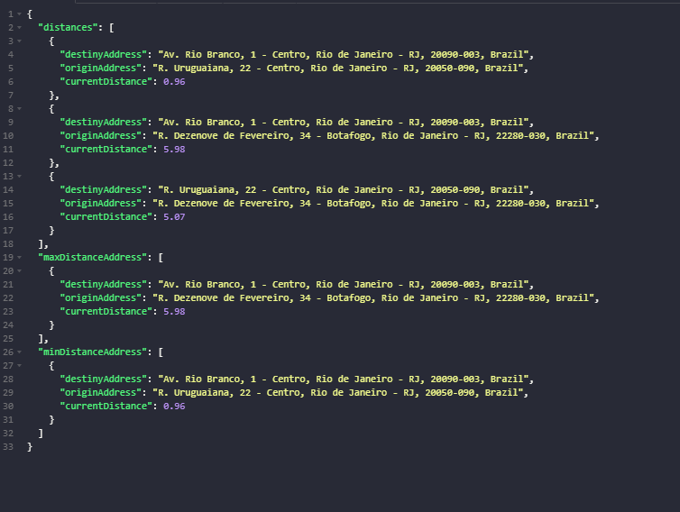

<p align="center">


<a href="https://www.linkedin.com/in/alquiponeto/">
    
</a>

<a href="https://github.com/Alquipo/Desafio-Calindra-BackEnd/commits/master">
    
</a>


</p>

<p align="center">

<a target="_blank" href="https://nodejs.org/">
    
  </a>

</p>
<h2 align="center">
  Desafio Backend Calindra Tech
</h2>

## 🚀 Sobre o desafio

A ideia do desafio é simples, entender como você pensa na hora de abordar os
problemas. Nas linguagens e tecnologias que se sentir mais confortável.

Criar uma API Rest que:

1. Receba dois ou mais endereços (ex: Av. Rio Branco, 1 Centro, Rio de Janeiro RJ,
   20090003; Praça Mal. Âncora, 122 Centro, Rio de Janeiro RJ, 20021200; Rua 19 de
   Fevereiro, 34 Botafogo, Rio de Janeiro RJ, 22280030 ) como parâmetros de entrada
2. Resolva a geolocalização entre os endereços utilizando a API do Google
   https://developers.google.com/maps/documentation/geocoding/start
3. Após isso, com a latitude e longitude em mãos dos endereços, implementar o algoritmo de
   cálculo de distância Euclidiana e aplicar em todas as combinações de endereços.
4. Retorne as distâncias calculadas entre os todos os endereços e indique os endereços
   mais próximos e também os endereços mais distantes.

<p align="center">

  
</p>

## 🔨 Tecnologias:

- [NodeJs][nodejs]
- [Express][express]
- [TypeScript](https://www.typescriptlang.org/)
- [Axios](https://github.com/axios/axios)
- [ts-node-dev](https://www.npmjs.com/package/ts-node-dev)
- [Eslint](https://eslint.org/)
- [Prettier]()

## 🚀 Como rodar este projeto

Para clonar e executar este aplicativo, você precisará de [Git](https://git-scm.com), [NodeJs][nodejs] Instalado em seu computador.

Para que possamos fazer requisições existe uma chave da API de Geocoding do Google que pode ser obtida por meio de uma conta teste, você pode obter a sua usando as seguintes instruções:

> Para obter uma chave de API: Visite o [Google Cloud Platform Console](https://console.cloud.google.com/).

    Clique no menu suspenso do projeto e selecione ou crie o projeto ao qual deseja adicionar uma chave de API.
    Clique no botão de menu e selecione APIs e serviços> Credenciais.
    Na página Credenciais, clique em Criar credenciais> Chave da API.
    O diálogo de chave de API criada exibe sua chave de API recém-criada. Clique em Fechar.
    A nova chave da API está listada na página Credenciais, em Chaves da API.

Coloque sua chave em um arquivo _.env_ ou _.*env.example*_ contido nesse repositório.

### 🌀 Clonando o repositório

```bash
# Clone este repositório
$ git clone https://github.com/Alquipo/Desafio-Calindra-BackEnd

# Acesse a pasta do projeto no terminal/cmd
$ cd Desafio-Calindra-BackEnd
```

### 🎲 Rodando a API

```bash
# Instale as dependências
$ npm install

# Execute a Aplicação
$ npm run dev:server


# O servidor inciará na porta:3333 - acesse http://localhost:3333
```

## 🔑 Rotas da aplicação

- **`GET /coordinates/:address`**: Essa rota retorna os dados dos endereços inseridos e também a distancia mais proxima e a mais distantes

> **`Exemplo da rota:`** _http://localhost:3333/coordinates/Av. Rio branco 1 - Centro, Rio de Janeiro - RJ+Rua 19 de fevereiro, 34 - Botafogo, Rio de Janeiro - RJ+Rua Uruguaiana 22, Centro_

```json
{
  "distances": [
    {
      "destinyAddress": "Av. Rio Branco, 1 - Centro, Rio de Janeiro - RJ, 20090-003, Brazil",
      "originAddress": "R. Uruguaiana, 22 - Centro, Rio de Janeiro - RJ, 20050-090, Brazil",
      "currentDistance": 0.96
    },
    {
      "destinyAddress": "Av. Rio Branco, 1 - Centro, Rio de Janeiro - RJ, 20090-003, Brazil",
      "originAddress": "R. Dezenove de Fevereiro, 34 - Botafogo, Rio de Janeiro - RJ, 22280-030, Brazil",
      "currentDistance": 5.98
    },
    {
      "destinyAddress": "R. Uruguaiana, 22 - Centro, Rio de Janeiro - RJ, 20050-090, Brazil",
      "originAddress": "R. Dezenove de Fevereiro, 34 - Botafogo, Rio de Janeiro - RJ, 22280-030, Brazil",
      "currentDistance": 5.07
    }
  ],
  "maxDistanceAddress": [
    {
      "destinyAddress": "Av. Rio Branco, 1 - Centro, Rio de Janeiro - RJ, 20090-003, Brazil",
      "originAddress": "R. Dezenove de Fevereiro, 34 - Botafogo, Rio de Janeiro - RJ, 22280-030, Brazil",
      "currentDistance": 5.98
    }
  ],
  "minDistanceAddress": [
    {
      "destinyAddress": "Av. Rio Branco, 1 - Centro, Rio de Janeiro - RJ, 20090-003, Brazil",
      "originAddress": "R. Uruguaiana, 22 - Centro, Rio de Janeiro - RJ, 20050-090, Brazil",
      "currentDistance": 0.96
    }
  ]
}
```

## 🤔 Como contribuir para o projeto

- Faça um **fork** do projeto;
- Crie uma nova branch com as suas alterações: `git checkout -b my-feature`
- Salve as alterações e crie uma mensagem de commit contando o que você fez:`git commit -m "feature: My new feature"`
- Envie as suas alterações: `git push origin my-feature`

> Caso tenha alguma dúvida confira este [guia de como contribuir no GitHub](https://github.com/firstcontributions/first-contributions)

## 📝 Licença

Este projeto esta sobe a licença MIT. Veja a [LICENÇA][license] para saber mais.

Feito com ❤️ por Alquipo Neto 👋🏽 [Entre em contato!](https://www.linkedin.com/in/alquiponeto/)

[nodejs]: https://nodejs.org/
[express]: https://expressjs.com/
[uuidv4]: https://www.npmjs.com/package/uuidv4
[nodemon]: https://www.npmjs.com/package/nodemon
[rs]: https://rocketseat.com.br
[license]: https://opensource.org/licenses/MIT
